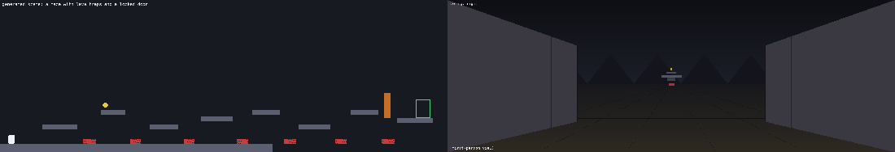

# Infinite Environment Generation via an Agent Harness

### ▶ [**Dashboard**](https://kargichauhan.github.io/Tech-Challenge-GI/)



**At a glance:**
- A real physics engine (pymunk) runs everything: gravity, jump arcs, and collisions are simulated, not scripted.
- One command turns text into a validated, playable environment. No API key needed.
- A second agent actively tries to reward-hack the win condition, and sometimes succeeds. Every scene reports whether it was gamed and how, which is the verifier-robustness problem that reward-model training depends on.
- Three agents play the same levels: a hand-built honest solver, a hand-built adversarial solver, and a tabular Q-learner that trains from scratch with a real learning curve.
- An invention loop mutates and revises scenes on its own, including changing the shape of the objective itself, and keeps a MAP-Elites archive of what it finds.

**Run it**:

```bash
python3 -m venv .venv && source .venv/bin/activate
pip install pymunk pygame imageio jsonschema networkx matplotlib anthropic
python3 run_demo.py
```

This generates 7 environments, runs the genuine solver and the adversarial verifier-probe on each, and writes one self-contained GIF per environment to `runs/demo/*.gif` (scene, then agent trace, then verifier-robustness result, under 30 seconds to read). Fully deterministic, no external dependency, the path reviewers should run first.

The full design rationale and the session-by-session story behind these decisions, including every bug found along the way, is in [WRITEUP.md](WRITEUP.md) if you want it. Everything below this line is the reference layer: what maps to the brief, what to run, and how it's built.

---

## Why this covers the brief

The brief said it would judge on three things, so here's the case made directly against each:

**Creativity.** Text commands become playable scenes through `run_claude_demo.py` (Claude reads your prompt, emits a scene via a forced tool call) or a code-based generator with no LLM at all. A second agent then tries to reward-hack the win condition instead of just solving it honestly, and a classifier reports how. An invention loop goes further, mutating and revising scenes on its own, including changing the shape of the objective itself, and keeps a MAP-Elites archive of what it finds. All of that is playable live from the dashboard link above.

**Clarity.** One command (`run_demo.py`), no API key, GIF output readable in under 30 seconds. The requirements-mapping and architecture sections below exist so a reviewer never has to go digging for how a specific brief line got addressed.

**Working output.** `run_demo.py` runs out of the box and is the guaranteed path. Nine more entry points below it are real, runnable, and each does something the guaranteed path doesn't (Claude-driven generation, a trained Q-learner, the invention loop, a bigger reward-model run), for anyone who wants to go deeper.

The brief's own three research motivations map directly, too: **post-training environments** to `harness/generation/policy_adaptation.py` and `harness/invention/`; **code-level objectives** ("picked up the can from the table") to `harness/schema/`'s event log and boolean-predicate objective language, checked entirely in code, with the brief's exact example as a real demo scene; and **reward model training** to `harness/render/dataset_emitter.py`'s `(frame, action, reward)` export, where a real CNN reaches held-out **R²=0.32** and roughly halves the error on the rare success/pickup events that matter most, versus blind guessing.

## The runnable entry points

All of these need only the venv above. Exceptions: `run_claude_demo.py` and `run_invention_loop.py --claude` also want `ANTHROPIC_API_KEY`, `run_reward_model_v2.py` wants `torch`, and the human-playable mode needs a real display.

| Script | What it does |
|---|---|
| `run_demo.py` | The guaranteed demo. Deterministic generation, genuine + adversarial solve, GIF per environment. |
| `run_claude_demo.py "<prompt>"` | Claude generates the scene from your text prompt *and* navigates it itself, then the same verifier probe runs for comparison. |
| `run_generation_adaptation.py` | 3 rounds × 8 environments over a fixed set of primitive combos, scores each, updates the sampling distribution, plots the trend. |
| `run_q_learning_demo.py [seed]` | Trains a tabular Q-learner from scratch, plots the learning curve, then plays the *trained* policy for real and renders it. |
| `run_invention_loop.py [--claude]` | The invention loop: warm-starts from the fixed combos, then mutates/evaluates/archives new scenes round by round (MAP-Elites). `--claude` layers Claude scene revision on top, falling back to code mutation automatically. |
| `run_maze_demo.py [seed]` | A "maze with lava traps and a locked door": a winding, zigzagging platform layout. |
| `run_dataset_export.py [seed]` | Dual (top-down + first-person) GIF plus a `(frame, action, reward)` dataset export and a linear reward-model fit on that episode. |
| `run_reward_model_v2.py [--fresh]` | The bigger reward-model run: many playthroughs, many scenes, held out by scene, linear method vs. a real small CNN. |
| `python3 -m harness.render.play_human` | An actual interactive window: arrow keys to move, space/up to jump. |

`run_claude_demo.py` and `run_invention_loop.py --claude` are optional upgrade layers, verified to reach the live API correctly, but the guaranteed deliverable is the deterministic path above them.

## Architecture

```
harness/schema/            scene schema, event-log schema, objective predicate language
harness/generation/        deterministic + freeform generators, validator, generation-policy
                           adaptation, coarse grid pathfinding oracle, archive charts
harness/engine/            pymunk physics engine: runs a scene, emits the event log,
                           detects boundary-clip tunneling natively (segment_query)
harness/solvers/           genuine solver, adversarial solver, and a tabular Q-learner
                           (the one agent that actually trains from scratch)
harness/verifier/          runs both solvers on the same scene, classifies how (or
                           whether) an adversarial success gamed the objective
harness/invention/         the invention loop: scene mutation, regret/exploit scoring,
                           behavior-space keying, novelty filtering, MAP-Elites archive
harness/render/            headless renderer + GIF assembly, human-playable mode,
                           first-person corridor renderer, dataset exporter
harness/claude_agent/      the Claude-API layer: scene generation, Claude-driven
                           navigation, and scene_reviser.py for the invention loop
```

**Scene schema.** Six primitives (`platform`, `ramp`, `door`, `key`, `hazard`, `pickup`) plus `player_start`/`goal_zone`. Doors lock and unlock via `key_id` matching.

**Event log and objectives.** The engine emits a flat log of `collision`, `pickup`, `door_open`, `zone_enter`, `zone_exit`, `death` events. An objective is a boolean predicate over that log (`and`/`or`/`not`), deliberately order-blind: it checks whether events happened, not in what sequence. That's the exact surface the adversarial probe is built to exploit.

**Solvers and verifier robustness.** Both solvers plan routes with a coarse grid model that simulates real jump physics, using the engine's own constants, not an approximation. The genuine solver collects requirements in the order a human would; the adversarial solver goes for whatever's cheapest and rams the goal zone first whenever reachable. `harness/verifier/probe.py` runs both and classifies the result:

| `exploit_class` | Meaning |
|---|---|
| `order_violation` | Objective satisfied, but a required event happened out of the order the level's geometry implies. |
| `unintended_path` | Goal reached without ever interacting with a door that appears to gate it. |
| `boundary_clip` | The engine's own tunneling: a swept path crossed solid geometry with no collision registering. Verified real via injected-velocity tests, but not reachable at the action space's normal speeds today (see Known limitations). |
| `none` | No exploit found. |

Every result also carries `honest_baseline_confirmed`, so an exploit found on a scene nobody proved solvable honestly is flagged as a weaker claim, not reported the same as a confirmed one.

**Generation-policy adaptation.** Each round samples `N=8` scenes from a fixed list of named combos, probes each, and scores it: `score = 0.5·genuine_solve_rate + 0.3·(1 − exploit_rate) + 0.2·(1 − validator_rejection_rate)`. The result reweights the next round's sampling distribution, with a floor so no combo ever hits zero. A plain weighted-sampling update, not code self-modification.

**The invention loop (explore / play / work / exploit).** A second, independent mechanism in `harness/invention/` that mutates or Claude-revises scenes freely instead of resampling a fixed list, and can change the objective's shape itself (not just which primitives appear). It scores candidates by a regret proxy (real solver ticks vs. a cheap closed-form estimate) and exploit-resistance, then keeps the best scene per behavior cell in a 2D MAP-Elites archive (path-length × interaction-count). Loosely modeled on published open-ended-learning research (ACCEL, POET, PLR, UED/PAIRED, OMNI-EPIC, MAP-Elites, Eureka/Voyager/ADAS): the conceptual basis for a much smaller version of the same idea, not a reproduction of any of them. `run_invention_loop.py` warm-starts from the six combos above as its round-0 seed set.

**Vision-policy bridge.** This world is a side-scrolling platformer with one horizontal axis, so a literal Wolfenstein-style raycaster has no second spatial axis to cast into. Instead `harness/render/raycaster.py` renders a **corridor-perspective first-person view**: real depth earned through time as the player approaches an object, dressed up with cosmetic 2.5D side panels and a parallax skyline that are drawn first, under every real feature, so real and decorative are never ambiguous. `run_dataset_export.py` exports `(frame, action, reward)` tuples in the challenge's action vocabulary, an honest approximate mapping since this world has no lateral strafe axis.

**The reward model.** A closed-form linear pass on one playthrough (no new dependency) was heavily underdetermined by design. A second pass trained a real CNN on 30 solved playthroughs, held out by scene:

| | held-out MSE | held-out MAE | held-out R² |
|---|---|---|---|
| Linear method, more data | 40.4 | 0.565 | -3,963 |
| Small CNN (torch), same data | 0.0069 | 0.020 | **0.32** |

The CNN's aggregate MAE (0.020) ties a trivial "guess the mean" baseline, because 685 of 697 held-out frames are just the common step penalty. Broken out by event type, the real signal shows up: on the 12 rare pickup/death/success frames, the CNN's MAE is 0.303 versus 0.621 for blind guessing, roughly twice as good on exactly the events a reward model needs to get right. A real sampling bug (missing single-tick events under stride-4 sampling) hid this signal entirely on the first run of this data; see WRITEUP.md for that story.

## Known limitations

- **Genuine-solver reliability varies by combo.** The hardest five-primitive combo solves honestly in roughly half of random seeds; simpler combos solve close to 100%. `honest_baseline_confirmed` exists so downstream reporting doesn't overclaim on the harder cases.
- **`boundary_clip` is verified-correct but currently dormant**, real and tested via injected velocity, but not reachable at the game's actual jump/move speeds since pymunk's speculative contacts resist tunneling well past that range.
- **Regret is a repurposed execution-gap proxy, not classic UED regret.** Classic regret is oracle return minus *trained-learner* return; only the Q-learner here is actually trained, so elsewhere this compares a real solver against a closed-form estimate instead.
- **The MAP-Elites archive is 2D, not the 4D in the original strategy document.** Rule-shape and irreversibility count are computed but kept as per-occupant metadata rather than grid axes, since a true 4D grid would be nearly empty at the batch sizes this loop runs.
- **The first-person renderer is a corridor-perspective view, not a full raycasting maze-caster**, since this world has only one true spatial axis.

Full bug-by-bug detail (feet-sensor deadlocks, jump-arc mismatches, an invention-loop logging bug, the reward-model sampling bug, and more), plus the implemented-vs-envisioned gaps against the original strategy document, are in [WRITEUP.md](WRITEUP.md).
